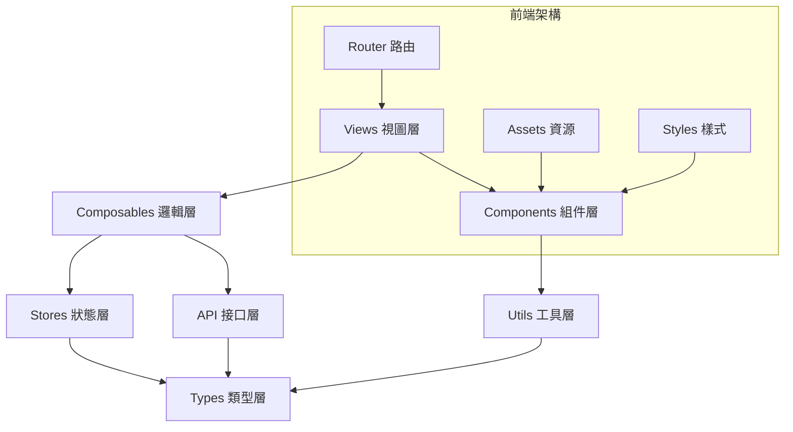

# 奇美食品客服語音分析系統 - 前端架構文檔

## 1. 專案概述

### 1.1 系統簡介
奇美食品客服語音分析系統前端基於 Vue 3 + TypeScript 架構，採用現代化的前端開發技術棧，為用戶提供直觀、高效的客服數據分析和管理界面。系統支援語音檔案上傳、AI 分析結果展示、多維度數據視覺化和權限管理等核心功能。

### 1.2 技術特色
- **現代化框架**：Vue 3 Composition API + TypeScript
- **響應式設計**：Element Plus UI 組件庫
- **數據視覺化**：ECharts 5.x 圖表庫
- **狀態管理**：Pinia 集中式狀態管理
- **開發體驗**：Vite 快速構建 + 熱重載
- **類型安全**：完整的 TypeScript 類型定義

### 1.3 核心價值
- **用戶體驗**：直觀的界面設計和流暢的交互體驗
- **開發效率**：模塊化架構和組件化開發
- **可維護性**：清晰的代碼結構和完善的類型系統
- **擴展性**：靈活的權限系統和可擴展的功能模塊

## 2. 技術架構

### 2.1 前端技術棧
```json
{
  "framework": "Vue 3.4+ (Composition API)",
  "buildTool": "Vite 5.0+",
  "language": "TypeScript 5.0+",
  "stateManagement": "Pinia 2.1+",
  "uiLibrary": "Element Plus 2.4+",
  "chartLibrary": "ECharts 5.4+ with Vue-ECharts",
  "httpClient": "Axios 1.6+",
  "router": "Vue Router 4+",
  "cssPreprocessor": "原生 CSS + CSS Variables",
  "icons": "Element Plus Icons"
}
```

### 2.2 項目結構
```
frontend/
├── public/                     # 靜態資源
│   ├── favicon.ico
│   └── index.html
├── src/
│   ├── api/                    # API 接口層
│   │   ├── auth.ts            # 認證相關 API
│   │   ├── users.ts           # 用戶管理 API
│   │   ├── files.ts           # 檔案管理 API
│   │   ├── analysis.ts        # 分析結果 API
│   │   ├── labels.ts          # 標籤管理 API
│   │   ├── dashboard.ts       # 儀表板 API
│   │   └── request.ts         # Axios 封裝
│   ├── assets/                 # 靜態資源
│   │   ├── images/            # 圖片資源
│   │   ├── icons/             # 圖標資源
│   │   └── styles/            # 樣式檔案
│   │       ├── global.css     # 全局樣式
│   │       ├── variables.css  # CSS 變數
│   │       └── element-plus.css # Element Plus 主題定制
│   ├── components/             # 可複用組件
│   │   ├── common/            # 通用組件
│   │   │   ├── LoadingSpinner.vue
│   │   │   ├── ErrorMessage.vue
│   │   │   └── ConfirmDialog.vue
│   │   ├── charts/            # 圖表組件
│   │   │   ├── BarChart.vue
│   │   │   ├── PieChart.vue
│   │   │   ├── LineChart.vue
│   │   │   └── StatCard.vue
│   │   ├── layout/            # 佈局組件
│   │   │   ├── MainLayout.vue
│   │   │   ├── Sidebar.vue
│   │   │   ├── Header.vue
│   │   │   └── Breadcrumb.vue
│   │   └── forms/             # 表單組件
│   │       ├── FileUpload.vue
│   │       ├── FilterPanel.vue
│   │       └── UserForm.vue
│   ├── composables/           # 組合式函數
│   │   ├── useAuth.ts         # 認證邏輯
│   │   ├── useApi.ts          # API 調用邏輯
│   │   ├── useChart.ts        # 圖表邏輯
│   │   ├── usePermission.ts   # 權限邏輯
│   │   └── useTable.ts        # 表格邏輯
│   ├── router/                # 路由配置
│   │   ├── index.ts           # 路由主配置
│   │   └── guards.ts          # 路由守衛
│   ├── stores/                # Pinia 狀態管理
│   │   ├── auth.ts            # 認證狀態
│   │   ├── user.ts            # 用戶狀態
│   │   ├── files.ts           # 檔案狀態
│   │   ├── analysis.ts        # 分析狀態
│   │   └── dashboard.ts       # 儀表板狀態
│   ├── types/                 # TypeScript 類型定義
│   │   ├── api.ts             # API 響應類型
│   │   ├── auth.ts            # 認證相關類型
│   │   ├── user.ts            # 用戶相關類型
│   │   ├── file.ts            # 檔案相關類型
│   │   ├── analysis.ts        # 分析相關類型
│   │   └── common.ts          # 通用類型
│   ├── utils/                 # 工具函數
│   │   ├── constants.ts       # 常數定義
│   │   ├── formatters.ts      # 格式化函數
│   │   ├── validators.ts      # 驗證函數
│   │   ├── request.ts         # HTTP 請求封裝
│   │   └── storage.ts         # 本地存儲封裝
│   ├── views/                 # 頁面組件
│   │   ├── auth/              # 認證相關頁面
│   │   │   └── LoginView.vue
│   │   ├── dashboard/         # 儀表板頁面
│   │   │   └── DashboardView.vue
│   │   ├── analysis/          # 分析頁面
│   │   │   ├── AnalysisView.vue
│   │   │   └── AnalysisDetailView.vue
│   │   ├── datasource/        # 資料來源頁面
│   │   │   ├── DataSourceView.vue
│   │   │   └── DataSourceDetailView.vue
│   │   ├── label/             # 標籤管理頁面
│   │   │   └── LabelSettingView.vue
│   │   └── account/           # 帳號管理頁面
│   │       └── AccountManagementView.vue
│   ├── App.vue                # 根組件
│   └── main.ts                # 應用入口
├── .env                       # 環境變數
├── .env.development          # 開發環境變數
├── .env.production           # 生產環境變數
├── index.html                # HTML 模板
├── package.json              # 依賴配置
├── tsconfig.json             # TypeScript 配置
├── vite.config.ts            # Vite 配置
└── README.md                 # 專案說明
```

### 2.3 架構設計圖


## 3. 核心功能實現

### 3.1 認證系統

#### 3.1.1 認證 Store
```typescript
// src/stores/auth.ts
import { defineStore } from 'pinia'
import { ref, computed } from 'vue'
import type { User, LoginForm, TokenResponse } from '@/types'
import { authApi } from '@/api/auth'
import { storage } from '@/utils/storage'

export const useAuthStore = defineStore('auth', () => {
  // 狀態
  const user = ref<User | null>(null)
  const token = ref<string | null>(storage.get('token'))
  const refreshToken = ref<string | null>(storage.get('refreshToken'))
  const isLoading = ref(false)

  // 計算屬性
  const isAuthenticated = computed(() => !!token.value && !!user.value)
  const userRole = computed(() => user.value?.role || 'viewer')
  const permissions = computed(() => {
    if (!user.value) return []
    return getPermissionsByRole(user.value.role)
  })

  // 登入
  const login = async (loginForm: LoginForm): Promise<void> => {
    isLoading.value = true
    try {
      const response = await authApi.login(loginForm)
      const { token: accessToken, refreshToken: newRefreshToken, user: userData } = response.data
      
      // 保存認證信息
      token.value = accessToken
      refreshToken.value = newRefreshToken
      user.value = userData
      
      // 持久化存儲
      storage.set('token', accessToken)
      storage.set('refreshToken', newRefreshToken)
      storage.set('user', userData)
      
    } catch (error) {
      throw error
    } finally {
      isLoading.value = false
    }
  }

  // 登出
  const logout = async (): Promise<void> => {
    try {
      if (token.value) {
        await authApi.logout()
      }
    } catch (error) {
      console.warn('Logout API call failed:', error)
    } finally {
      // 清除狀態
      user.value = null
      token.value = null
      refreshToken.value = null
      
      // 清除存儲
      storage.remove('token')
      storage.remove('refreshToken')
      storage.remove('user')
    }
  }

  // 刷新 Token
  const refreshAccessToken = async (): Promise<string | null> => {
    if (!refreshToken.value) return null
    
    try {
      const response = await authApi.refreshToken(refreshToken.value)
      const { token: newToken, refreshToken: newRefreshToken } = response.data
      
      token.value = newToken
      refreshToken.value = newRefreshToken
      
      storage.set('token', newToken)
      storage.set('refreshToken', newRefreshToken)
      
      return newToken
    } catch (error) {
      await logout()
      return null
    }
  }

  // 初始化認證狀態
  const initAuth = (): void => {
    const storedToken = storage.get('token')
    const storedUser = storage.get('user')
    
    if (storedToken && storedUser) {
      token.value = storedToken
      user.value = storedUser
    }
  }

  return {
    user: readonly(user),
    token: readonly(token),
    isLoading: readonly(isLoading),
    isAuthenticated,
    userRole,
    permissions,
    login,
    logout,
    refreshAccessToken,
    initAuth
  }
})
```

#### 3.1.2 路由守衛
```typescript
// src/router/guards.ts
import type { NavigationGuardNext, RouteLocationNormalized } from 'vue-router'
import { useAuthStore } from '@/stores/auth'
import { Permission } from '@/utils/constants'

// 認證守衛
export const authGuard = (
  to: RouteLocationNormalized,
  from: RouteLocationNormalized,
  next: NavigationGuardNext
) => {
  const authStore = useAuthStore()
  
  const requiresAuth = to.matched.some(record => record.meta.requiresAuth !== false)
  
  if (requiresAuth && !authStore.isAuthenticated) {
    next('/login')
    return
  }
  
  next()
}

// 權限守衛
export const permissionGuard = (
  to: RouteLocationNormalized,
  from: RouteLocationNormalized,
  next: NavigationGuardNext
) => {
  const authStore = useAuthStore()
  const requiredPermission = to.meta.permission as Permission
  
  if (requiredPermission && !authStore.permissions.includes(requiredPermission)) {
    next('/403') // 無權限頁面
    return
  }
  
  next()
}
```

### 3.2 API 封裝

#### 3.2.1 HTTP 請求封裝
```typescript
// src/utils/request.ts
import axios, { AxiosResponse, AxiosError, InternalAxiosRequestConfig } from 'axios'
import { ElMessage } from 'element-plus'
import { useAuthStore } from '@/stores/auth'
import type { ApiResponse } from '@/types'

const API_BASE_URL = import.meta.env.VITE_API_BASE_URL || 'http://localhost:8100'

// 創建 axios 實例
const request = axios.create({
  baseURL: `${API_BASE_URL}/api/v1`,
  timeout: 30000,
  headers: {
    'Content-Type': 'application/json'
  }
})

// 請求攔截器
request.interceptors.request.use(
  (config: InternalAxiosRequestConfig) => {
    const authStore = useAuthStore()
    
    // 自動添加認證 Token
    if (authStore.token && config.headers) {
      config.headers.Authorization = `Bearer ${authStore.token}`
    }
    
    return config
  },
  (error: AxiosError) => {
    return Promise.reject(error)
  }
)

// 響應攔截器
request.interceptors.response.use(
  (response: AxiosResponse<ApiResponse>) => {
    const { code, message, data } = response.data
    
    // API 成功響應
    if (code === 0) {
      return { ...response, data }
    }
    
    // API 錯誤響應
    ElMessage.error(message || '請求失敗')
    return Promise.reject(new Error(message || '請求失敗'))
  },
  async (error: AxiosError) => {
    const authStore = useAuthStore()
    
    // Token 過期，嘗試刷新
    if (error.response?.status === 401) {
      const newToken = await authStore.refreshAccessToken()
      
      if (newToken && error.config) {
        error.config.headers.Authorization = `Bearer ${newToken}`
        return request.request(error.config)
      } else {
        // 刷新失敗，跳轉登入頁
        authStore.logout()
        window.location.href = '/login'
      }
    }
    
    // 其他錯誤處理
    const message = error.response?.data?.message || error.message || '網路錯誤'
    ElMessage.error(message)
    
    return Promise.reject(error)
  }
)

export default request
```

#### 3.2.2 API 服務層
```typescript
// src/api/files.ts
import request from '@/utils/request'
import type { FileListParams, FileDetail, UploadResponse } from '@/types'

export const filesApi = {
  // 獲取檔案列表
  getFiles: (params: FileListParams) => {
    return request.get('/files', { params })
  },

  // 上傳檔案
  uploadFiles: (files: File[], onProgress?: (progress: number) => void) => {
    const formData = new FormData()
    files.forEach(file => {
      formData.append('files', file)
    })

    return request.post<UploadResponse>('/files/upload', formData, {
      headers: {
        'Content-Type': 'multipart/form-data'
      },
      onUploadProgress: (progressEvent) => {
        if (onProgress && progressEvent.total) {
          const progress = Math.round((progressEvent.loaded * 100) / progressEvent.total)
          onProgress(progress)
        }
      }
    })
  },

  // 獲取檔案詳情
  getFileDetail: (id: number) => {
    return request.get<FileDetail>(`/files/${id}`)
  },

  // 刪除檔案
  deleteFile: (id: number) => {
    return request.delete(`/files/${id}`)
  }
}
```

### 3.3 狀態管理

#### 3.3.1 檔案管理 Store
```typescript
// src/stores/files.ts
import { defineStore } from 'pinia'
import { ref, computed } from 'vue'
import type { FileItem, FileListParams, FileDetail } from '@/types'
import { filesApi } from '@/api/files'

export const useFilesStore = defineStore('files', () => {
  // 狀態
  const files = ref<FileItem[]>([])
  const currentFile = ref<FileDetail | null>(null)
  const isLoading = ref(false)
  const uploadProgress = ref(0)
  const pagination = ref({
    page: 1,
    pageSize: 20,
    total: 0
  })

  // 計算屬性
  const hasFiles = computed(() => files.value.length > 0)
  const processingFiles = computed(() => 
    files.value.filter(file => file.status === 'processing')
  )
  const completedFiles = computed(() => 
    files.value.filter(file => file.status === 'completed')
  )

  // 獲取檔案列表
  const fetchFiles = async (params?: Partial<FileListParams>) => {
    isLoading.value = true
    try {
      const response = await filesApi.getFiles({
        page: pagination.value.page,
        pageSize: pagination.value.pageSize,
        ...params
      })
      
      files.value = response.data.items
      pagination.value = {
        page: response.data.page,
        pageSize: response.data.pageSize,
        total: response.data.total
      }
    } catch (error) {
      console.error('Failed to fetch files:', error)
    } finally {
      isLoading.value = false
    }
  }

  // 上傳檔案
  const uploadFiles = async (fileList: File[]) => {
    try {
      uploadProgress.value = 0
      const response = await filesApi.uploadFiles(fileList, (progress) => {
        uploadProgress.value = progress
      })
      
      // 刷新檔案列表
      await fetchFiles()
      
      return response.data
    } catch (error) {
      uploadProgress.value = 0
      throw error
    }
  }

  // 獲取檔案詳情
  const fetchFileDetail = async (id: number) => {
    isLoading.value = true
    try {
      const response = await filesApi.getFileDetail(id)
      currentFile.value = response.data
      return response.data
    } catch (error) {
      console.error('Failed to fetch file detail:', error)
      throw error
    } finally {
      isLoading.value = false
    }
  }

  // 刪除檔案
  const deleteFile = async (id: number) => {
    try {
      await filesApi.deleteFile(id)
      // 從列表中移除
      files.value = files.value.filter(file => file.id !== id)
      // 更新分頁總數
      pagination.value.total -= 1
    } catch (error) {
      console.error('Failed to delete file:', error)
      throw error
    }
  }

  return {
    files: readonly(files),
    currentFile: readonly(currentFile),
    isLoading: readonly(isLoading),
    uploadProgress: readonly(uploadProgress),
    pagination: readonly(pagination),
    hasFiles,
    processingFiles,
    completedFiles,
    fetchFiles,
    uploadFiles,
    fetchFileDetail,
    deleteFile
  }
})
```

### 3.4 組合式函數

#### 3.4.1 圖表邏輯
```typescript
// src/composables/useChart.ts
import { ref, computed, watch, type Ref } from 'vue'
import type { ECharts } from 'echarts'
import type { ChartOptions, ChartData } from '@/types'

export function useChart(
  chartRef: Ref<HTMLElement | null>,
  options: Ref<ChartOptions>
) {
  const chartInstance = ref<ECharts | null>(null)
  const isLoading = ref(false)

  // 初始化圖表
  const initChart = async () => {
    if (!chartRef.value) return

    const echarts = await import('echarts')
    chartInstance.value = echarts.init(chartRef.value)
    
    // 監聽 options 變化
    watch(options, (newOptions) => {
      if (chartInstance.value) {
        chartInstance.value.setOption(newOptions, true)
      }
    }, { deep: true, immediate: true })

    // 監聽視窗大小變化
    window.addEventListener('resize', handleResize)
  }

  // 更新圖表數據
  const updateChart = (data: ChartData) => {
    if (chartInstance.value) {
      isLoading.value = true
      chartInstance.value.setOption({
        ...options.value,
        series: data.series,
        xAxis: { data: data.categories },
        legend: { data: data.legend }
      }, true)
      isLoading.value = false
    }
  }

  // 處理圖表點擊事件
  const handleChartClick = (callback: (params: any) => void) => {
    if (chartInstance.value) {
      chartInstance.value.on('click', callback)
    }
  }

  // 響應式調整
  const handleResize = () => {
    if (chartInstance.value) {
      chartInstance.value.resize()
    }
  }

  // 銷毀圖表
  const destroyChart = () => {
    if (chartInstance.value) {
      chartInstance.value.dispose()
      chartInstance.value = null
    }
    window.removeEventListener('resize', handleResize)
  }

  return {
    chartInstance: readonly(chartInstance),
    isLoading: readonly(isLoading),
    initChart,
    updateChart,
    handleChartClick,
    destroyChart
  }
}
```

#### 3.4.2 表格邏輯
```typescript
// src/composables/useTable.ts
import { ref, computed, reactive } from 'vue'
import type { TableColumn, TableData, PaginationConfig } from '@/types'

export function useTable<T = any>(
  fetchData: (params: any) => Promise<{ items: T[]; total: number }>,
  columns: TableColumn[]
) {
  const tableData = ref<T[]>([])
  const isLoading = ref(false)
  const selectedRows = ref<T[]>([])
  
  const pagination = reactive<PaginationConfig>({
    page: 1,
    pageSize: 20,
    total: 0
  })

  const filters = ref<Record<string, any>>({})
  const sortConfig = ref<{ prop: string; order: 'asc' | 'desc' } | null>(null)

  // 計算屬性
  const hasData = computed(() => tableData.value.length > 0)
  const hasSelection = computed(() => selectedRows.value.length > 0)
  const totalPages = computed(() => Math.ceil(pagination.total / pagination.pageSize))

  // 載入數據
  const loadData = async (resetPage = false) => {
    if (resetPage) {
      pagination.page = 1
    }

    isLoading.value = true
    try {
      const params = {
        page: pagination.page,
        pageSize: pagination.pageSize,
        ...filters.value,
        ...(sortConfig.value && {
          sortBy: sortConfig.value.prop,
          sortOrder: sortConfig.value.order
        })
      }

      const response = await fetchData(params)
      tableData.value = response.items
      pagination.total = response.total
    } catch (error) {
      console.error('Failed to load table data:', error)
      tableData.value = []
      pagination.total = 0
    } finally {
      isLoading.value = false
    }
  }

  // 分頁變化
  const handlePageChange = (page: number) => {
    pagination.page = page
    loadData()
  }

  // 頁面大小變化
  const handlePageSizeChange = (pageSize: number) => {
    pagination.pageSize = pageSize
    pagination.page = 1
    loadData()
  }

  // 排序變化
  const handleSortChange = ({ prop, order }: { prop: string; order: string }) => {
    sortConfig.value = order ? { prop, order: order as 'asc' | 'desc' } : null
    loadData(true)
  }

  // 選擇變化
  const handleSelectionChange = (selection: T[]) => {
    selectedRows.value = selection
  }

  // 篩選變化
  const handleFilterChange = (newFilters: Record<string, any>) => {
    filters.value = { ...filters.value, ...newFilters }
    loadData(true)
  }

  // 重置篩選
  const resetFilters = () => {
    filters.value = {}
    sortConfig.value = null
    loadData(true)
  }

  // 刷新數據
  const refresh = () => {
    loadData()
  }

  return {
    tableData: readonly(tableData),
    isLoading: readonly(isLoading),
    selectedRows: readonly(selectedRows),
    pagination: readonly(pagination),
    filters: readonly(filters),
    hasData,
    hasSelection,
    totalPages,
    loadData,
    handlePageChange,
    handlePageSizeChange,
    handleSortChange,
    handleSelectionChange,
    handleFilterChange,
    resetFilters,
    refresh
  }
}
```

### 3.5 UI 組件庫

#### 3.5.1 圖表組件
```vue
<!-- src/components/charts/StatCard.vue -->
<template>
  <el-card class="stat-card" :class="cardClass" shadow="hover">
    <div class="stat-header">
      <div class="stat-icon">
        <el-icon :size="24">
          <component :is="icon" />
        </el-icon>
      </div>
      <div class="stat-content">
        <div class="stat-title">{{ title }}</div>
        <div class="stat-value">{{ formattedValue }}</div>
      </div>
    </div>
    <div class="stat-footer" v-if="trend">
      <span class="trend" :class="trendClass">
        <el-icon :size="14">
          <component :is="trendIcon" />
        </el-icon>
        {{ trendText }}
      </span>
      <span class="period">{{ period }}</span>
    </div>
  </el-card>
</template>

<script setup lang="ts">
import { computed } from 'vue'
import { ArrowUp, ArrowDown, Minus } from '@element-plus/icons-vue'
import { formatNumber } from '@/utils/formatters'

interface Props {
  title: string
  value: number
  icon: any
  trend?: {
    value: number
    type: 'increase' | 'decrease' | 'stable'
  }
  period?: string
  type?: 'primary' | 'success' | 'warning' | 'danger'
}

const props = withDefaults(defineProps<Props>(), {
  period: '較昨日',
  type: 'primary'
})

const formattedValue = computed(() => formatNumber(props.value))

const cardClass = computed(() => `stat-card--${props.type}`)

const trendClass = computed(() => {
  if (!props.trend) return ''
  return `trend--${props.trend.type}`
})

const trendIcon = computed(() => {
  if (!props.trend) return Minus
  switch (props.trend.type) {
    case 'increase': return ArrowUp
    case 'decrease': return ArrowDown
    default: return Minus
  }
})

const trendText = computed(() => {
  if (!props.trend) return ''
  const sign = props.trend.type === 'increase' ? '+' : props.trend.type === 'decrease' ? '-' : ''
  return `${sign}${Math.abs(props.trend.value)}%`
})
</script>

<style scoped>
.stat-card {
  border-radius: 8px;
  transition: all 0.3s ease;
}

.stat-card:hover {
  transform: translateY(-2px);
}

.stat-header {
  display: flex;
  align-items: center;
  gap: 16px;
}

.stat-icon {
  width: 48px;
  height: 48px;
  border-radius: 50%;
  display: flex;
  align-items: center;
  justify-content: center;
  background: var(--el-color-primary-light-9);
  color: var(--el-color-primary);
}

.stat-card--success .stat-icon {
  background: var(--el-color-success-light-9);
  color: var(--el-color-success);
}

.stat-card--warning .stat-icon {
  background: var(--el-color-warning-light-9);
  color: var(--el-color-warning);
}

.stat-card--danger .stat-icon {
  background: var(--el-color-danger-light-9);
  color: var(--el-color-danger);
}

.stat-content {
  flex: 1;
}

.stat-title {
  font-size: 14px;
  color: var(--el-text-color-regular);
  margin-bottom: 4px;
}

.stat-value {
  font-size: 24px;
  font-weight: 600;
  color: var(--el-text-color-primary);
}

.stat-footer {
  display: flex;
  justify-content: space-between;
  align-items: center;
  margin-top: 16px;
  padding-top: 16px;
  border-top: 1px solid var(--el-border-color-lighter);
  font-size: 12px;
}

.trend {
  display: flex;
  align-items: center;
  gap: 4px;
}

.trend--increase {
  color: var(--el-color-success);
}

.trend--decrease {
  color: var(--el-color-danger);
}

.trend--stable {
  color: var(--el-text-color-regular);
}

.period {
  color: var(--el-text-color-regular);
}
</style>
```

#### 3.5.2 檔案上傳組件
```vue
<!-- src/components/forms/FileUpload.vue -->
<template>
  <div class="file-upload">
    <el-upload
      ref="uploadRef"
      class="upload-demo"
      drag
      multiple
      :auto-upload="false"
      :accept="acceptedTypes"
      :before-upload="beforeUpload"
      :on-change="handleFileChange"
      :on-remove="handleFileRemove"
      :file-list="fileList"
      :limit="maxFiles"
      :on-exceed="handleExceed"
    >
      <div class="upload-content">
        <el-icon class="upload-icon"><upload-filled /></el-icon>
        <div class="upload-text">
          <p>拖放檔案到此處，或 <em>點擊選擇檔案</em></p>
          <p class="upload-tip">
            支援格式：{{ acceptedTypesText }}，檔案大小不超過 {{ maxSizeText }}
          </p>
        </div>
      </div>
    </el-upload>

    <div class="upload-actions" v-if="hasFiles">
      <el-button type="primary" @click="handleUpload" :loading="isUploading">
        <el-icon><upload /></el-icon>
        {{ isUploading ? '上傳中...' : '開始上傳' }}
      </el-button>
      <el-button @click="clearFiles">
        <el-icon><delete /></el-icon>
        清除全部
      </el-button>
    </div>

    <el-progress
      v-if="isUploading"
      :percentage="uploadProgress"
      :status="uploadStatus"
      class="upload-progress"
    />
  </div>
</template>

<script setup lang="ts">
import { ref, computed } from 'vue'
import { ElMessage, ElNotification } from 'element-plus'
import { UploadFilled, Upload, Delete } from '@element-plus/icons-vue'
import type { UploadFile, UploadFiles, UploadInstance } from 'element-plus'
import { useFilesStore } from '@/stores/files'

interface Props {
  maxFiles?: number
  maxSize?: number // MB
  acceptedTypes?: string[]
}

const props = withDefaults(defineProps<Props>(), {
  maxFiles: 10,
  maxSize: 100,
  acceptedTypes: () => ['.wav', '.mp3', '.txt']
})

const emit = defineEmits<{
  success: [files: any[]]
  error: [error: Error]
}>()

const filesStore = useFilesStore()
const uploadRef = ref<UploadInstance>()
const fileList = ref<UploadFile[]>([])
const isUploading = ref(false)
const uploadProgress = ref(0)

// 計算屬性
const hasFiles = computed(() => fileList.value.length > 0)
const acceptedTypesText = computed(() => props.acceptedTypes.join(', '))
const maxSizeText = computed(() => `${props.maxSize}MB`)

const uploadStatus = computed(() => {
  if (uploadProgress.value >= 100) return 'success'
  if (isUploading.value) return undefined
  return undefined
})

// 檔案變化處理
const handleFileChange = (file: UploadFile, files: UploadFiles) => {
  fileList.value = files
}

// 檔案移除處理
const handleFileRemove = (file: UploadFile, files: UploadFiles) => {
  fileList.value = files
}

// 檔案上傳前驗證
const beforeUpload = (file: File) => {
  // 檢查檔案類型
  const isValidType = props.acceptedTypes.some(type => 
    file.name.toLowerCase().endsWith(type.toLowerCase())
  )
  if (!isValidType) {
    ElMessage.error(`檔案格式不支援，請上傳 ${acceptedTypesText.value} 格式的檔案`)
    return false
  }

  // 檢查檔案大小
  const isValidSize = file.size / 1024 / 1024 < props.maxSize
  if (!isValidSize) {
    ElMessage.error(`檔案大小不能超過 ${maxSizeText.value}`)
    return false
  }

  return true
}

// 檔案數量超限處理
const handleExceed = (files: File[], uploadFiles: UploadFile[]) => {
  ElMessage.warning(`最多只能上傳 ${props.maxFiles} 個檔案`)
}

// 開始上傳
const handleUpload = async () => {
  if (!hasFiles.value) {
    ElMessage.warning('請先選擇要上傳的檔案')
    return
  }

  isUploading.value = true
  uploadProgress.value = 0

  try {
    const filesToUpload = fileList.value
      .filter(file => file.raw)
      .map(file => file.raw!) as File[]

    // 監聽上傳進度
    filesStore.$subscribe((mutation, state) => {
      uploadProgress.value = state.uploadProgress
    })

    const result = await filesStore.uploadFiles(filesToUpload)
    
    uploadProgress.value = 100
    ElNotification.success({
      title: '上傳成功',
      message: `成功上傳 ${filesToUpload.length} 個檔案`
    })

    emit('success', result)
    clearFiles()

  } catch (error) {
    console.error('Upload failed:', error)
    ElNotification.error({
      title: '上傳失敗',
      message: error instanceof Error ? error.message : '檔案上傳失敗'
    })
    emit('error', error as Error)
  } finally {
    isUploading.value = false
    uploadProgress.value = 0
  }
}

// 清除檔案
const clearFiles = () => {
  uploadRef.value?.clearFiles()
  fileList.value = []
}
</script>

<style scoped>
.file-upload {
  width: 100%;
}

.upload-demo {
  width: 100%;
}

.upload-content {
  text-align: center;
  padding: 40px 20px;
}

.upload-icon {
  font-size: 48px;
  color: var(--el-color-primary);
  margin-bottom: 16px;
}

.upload-text p {
  margin: 8px 0;
  color: var(--el-text-color-regular);
}

.upload-text em {
  color: var(--el-color-primary);
  font-style: normal;
}

.upload-tip {
  font-size: 12px;
  color: var(--el-text-color-placeholder);
}

.upload-actions {
  margin-top: 16px;
  display: flex;
  gap: 12px;
  justify-content: center;
}

.upload-progress {
  margin-top: 16px;
}

:deep(.el-upload-dragger) {
  border: 2px dashed var(--el-border-color);
  border-radius: 6px;
  background: var(--el-fill-color-blank);
  transition: all 0.3s ease;
}

:deep(.el-upload-dragger:hover) {
  border-color: var(--el-color-primary);
  background: var(--el-color-primary-light-9);
}

:deep(.el-upload-dragger.is-dragover) {
  border-color: var(--el-color-primary);
  background: var(--el-color-primary-light-9);
}
</style>
```

### 3.6 頁面組件

#### 3.6.1 儀表板頁面
```vue
<!-- src/views/dashboard/DashboardView.vue -->
<template>
  <div class="dashboard">
    <div class="dashboard-header">
      <h1>營運洞察</h1>
      <div class="header-actions">
        <el-select v-model="timeRange" @change="handleTimeRangeChange">
          <el-option label="近7天" value="7" />
          <el-option label="近30天" value="30" />
          <el-option label="近90天" value="90" />
        </el-select>
        <el-button @click="refreshData" :loading="isLoading">
          <el-icon><refresh /></el-icon>
          刷新
        </el-button>
      </div>
    </div>

    <!-- 統計卡片 -->
    <div class="stats-grid">
      <StatCard
        title="總檔案數"
        :value="stats.totalFiles"
        :icon="Document"
        type="primary"
        :trend="{ value: 12, type: 'increase' }"
      />
      <StatCard
        title="今日新增"
        :value="stats.todayFiles"
        :icon="Plus"
        type="success"
        :trend="{ value: 8, type: 'increase' }"
      />
      <StatCard
        title="處理中"
        :value="stats.processingFiles"
        :icon="Loading"
        type="warning"
      />
      <StatCard
        title="處理失敗"
        :value="stats.failedFiles"
        :icon="Warning"
        type="danger"
      />
    </div>

    <!-- 圖表區域 -->
    <div class="charts-grid">
      <!-- 商品提及排行 -->
      <el-card class="chart-card">
        <template #header>
          <div class="card-header">
            <span>商品提及排行</span>
            <el-button text @click="viewDetails('products')">
              查看詳細 <el-icon><arrow-right /></el-icon>
            </el-button>
          </div>
        </template>
        <BarChart
          :data="productMentionsData"
          :options="barChartOptions"
          @chart-click="handleProductClick"
          height="300px"
        />
      </el-card>

      <!-- 情感分析分布 -->
      <el-card class="chart-card">
        <template #header>
          <div class="card-header">
            <span>情感分析分布</span>
            <el-button text @click="viewDetails('sentiment')">
              查看詳細 <el-icon><arrow-right /></el-icon>
            </el-button>
          </div>
        </template>
        <PieChart
          :data="sentimentData"
          :options="pieChartOptions"
          @chart-click="handleSentimentClick"
          height="300px"
        />
      </el-card>

      <!-- 反饋類型統計 -->
      <el-card class="chart-card">
        <template #header>
          <div class="card-header">
            <span>反饋類型統計</span>
            <el-button text @click="viewDetails('feedback')">
              查看詳細 <el-icon><arrow-right /></el-icon>
            </el-button>
          </div>
        </template>
        <BarChart
          :data="feedbackTypesData"
          :options="barChartOptions"
          height="300px"
        />
      </el-card>

      <!-- 每日趨勢 -->
      <el-card class="chart-card full-width">
        <template #header>
          <div class="card-header">
            <span>每日處理趨勢</span>
            <el-button text @click="viewDetails('trend')">
              查看詳細 <el-icon><arrow-right /></el-icon>
            </el-button>
          </div>
        </template>
        <LineChart
          :data="dailyTrendData"
          :options="lineChartOptions"
          height="400px"
        />
      </el-card>
    </div>
  </div>
</template>

<script setup lang="ts">
import { ref, onMounted, computed } from 'vue'
import { useRouter } from 'vue-router'
import { ElMessage } from 'element-plus'
import { 
  Document, Plus, Loading, Warning, 
  Refresh, ArrowRight 
} from '@element-plus/icons-vue'
import StatCard from '@/components/charts/StatCard.vue'
import BarChart from '@/components/charts/BarChart.vue'
import PieChart from '@/components/charts/PieChart.vue'
import LineChart from '@/components/charts/LineChart.vue'
import { useDashboardStore } from '@/stores/dashboard'
import type { ChartClickParams } from '@/types'

const router = useRouter()
const dashboardStore = useDashboardStore()

const timeRange = ref('7')
const isLoading = ref(false)

// 計算屬性
const stats = computed(() => dashboardStore.stats)
const productMentionsData = computed(() => dashboardStore.productMentionsChart)
const sentimentData = computed(() => dashboardStore.sentimentChart)
const feedbackTypesData = computed(() => dashboardStore.feedbackTypesChart)
const dailyTrendData = computed(() => dashboardStore.dailyTrendChart)

// 圖表配置
const barChartOptions = computed(() => ({
  grid: { left: '3%', right: '4%', bottom: '3%', containLabel: true },
  xAxis: { type: 'category' },
  yAxis: { type: 'value' },
  tooltip: { trigger: 'axis' },
  series: [{
    type: 'bar',
    itemStyle: { color: '#409EFF' }
  }]
}))

const pieChartOptions = computed(() => ({
  tooltip: { trigger: 'item' },
  legend: { orient: 'vertical', left: 'left' },
  series: [{
    type: 'pie',
    radius: '50%',
    emphasis: { itemStyle: { shadowBlur: 10 } }
  }]
}))

const lineChartOptions = computed(() => ({
  grid: { left: '3%', right: '4%', bottom: '3%', containLabel: true },
  xAxis: { type: 'category', boundaryGap: false },
  yAxis: { type: 'value' },
  tooltip: { trigger: 'axis' },
  series: [{
    type: 'line',
    smooth: true,
    itemStyle: { color: '#67C23A' }
  }]
}))

// 載入數據
const loadData = async () => {
  isLoading.value = true
  try {
    await Promise.all([
      dashboardStore.fetchStats(),
      dashboardStore.fetchProductMentionsChart(Number(timeRange.value)),
      dashboardStore.fetchSentimentChart(Number(timeRange.value)),
      dashboardStore.fetchFeedbackTypesChart(Number(timeRange.value)),
      dashboardStore.fetchDailyTrendChart(Number(timeRange.value))
    ])
  } catch (error) {
    console.error('Failed to load dashboard data:', error)
    ElMessage.error('載入數據失敗')
  } finally {
    isLoading.value = false
  }
}

// 時間範圍變化
const handleTimeRangeChange = () => {
  loadData()
}

// 刷新數據
const refreshData = () => {
  loadData()
}

// 圖表點擊處理
const handleProductClick = (params: ChartClickParams) => {
  router.push({
    path: '/analysis',
    query: { product: params.name }
  })
}

const handleSentimentClick = (params: ChartClickParams) => {
  router.push({
    path: '/analysis',
    query: { sentiment: params.name }
  })
}

// 查看詳細
const viewDetails = (type: string) => {
  router.push('/analysis')
}

onMounted(() => {
  loadData()
})
</script>

<style scoped>
.dashboard {
  padding: 24px;
}

.dashboard-header {
  display: flex;
  justify-content: space-between;
  align-items: center;
  margin-bottom: 24px;
}

.dashboard-header h1 {
  margin: 0;
  font-size: 24px;
  font-weight: 600;
  color: var(--el-text-color-primary);
}

.header-actions {
  display: flex;
  gap: 12px;
  align-items: center;
}

.stats-grid {
  display: grid;
  grid-template-columns: repeat(auto-fit, minmax(240px, 1fr));
  gap: 24px;
  margin-bottom: 24px;
}

.charts-grid {
  display: grid;
  grid-template-columns: repeat(auto-fit, minmax(400px, 1fr));
  gap: 24px;
}

.chart-card {
  border-radius: 8px;
}

.chart-card.full-width {
  grid-column: 1 / -1;
}

.card-header {
  display: flex;
  justify-content: space-between;
  align-items: center;
}

.card-header span {
  font-weight: 600;
  color: var(--el-text-color-primary);
}

@media (max-width: 768px) {
  .dashboard {
    padding: 16px;
  }
  
  .dashboard-header {
    flex-direction: column;
    gap: 16px;
    align-items: stretch;
  }
  
  .charts-grid {
    grid-template-columns: 1fr;
  }
  
  .stats-grid {
    grid-template-columns: repeat(auto-fit, minmax(200px, 1fr));
  }
}
</style>
```

## 4. 構建與部署

### 4.1 Vite 配置
```typescript
// vite.config.ts
import { defineConfig, loadEnv } from 'vite'
import vue from '@vitejs/plugin-vue'
import { resolve } from 'path'
import { ElementPlusResolver } from 'unplugin-vue-components/resolvers'
import Components from 'unplugin-vue-components/vite'
import AutoImport from 'unplugin-auto-import/vite'

export default defineConfig(({ mode }) => {
  const env = loadEnv(mode, process.cwd(), '')
  
  return {
    plugins: [
      vue(),
      // Element Plus 自動導入
      AutoImport({
        resolvers: [ElementPlusResolver()],
        imports: ['vue', 'vue-router', 'pinia']
      }),
      Components({
        resolvers: [ElementPlusResolver()]
      })
    ],
    
    resolve: {
      alias: {
        '@': resolve(__dirname, 'src')
      }
    },
    
    server: {
      port: 3000,
      proxy: {
        '/api': {
          target: env.VITE_API_BASE_URL || 'http://localhost:8100',
          changeOrigin: true,
          secure: false
        }
      }
    },
    
    build: {
      target: 'es2015',
      outDir: 'dist',
      sourcemap: mode === 'development',
      rollupOptions: {
        output: {
          chunkFileNames: 'js/[name]-[hash].js',
          entryFileNames: 'js/[name]-[hash].js',
          assetFileNames: 'assets/[name]-[hash].[ext]',
          manualChunks: {
            'element-plus': ['element-plus'],
            'echarts': ['echarts'],
            'vue-vendor': ['vue', 'vue-router', 'pinia']
          }
        }
      }
    },
    
    optimizeDeps: {
      include: ['vue', 'vue-router', 'pinia', 'element-plus', 'echarts']
    }
  }
})
```

### 4.2 環境配置
```bash
# .env.development
VITE_APP_TITLE=奇美食品客服語音分析系統
VITE_API_BASE_URL=http://localhost:8100
VITE_UPLOAD_URL=http://localhost:8100/api/v1/files/upload
VITE_MAX_FILE_SIZE=104857600
```

```bash
# .env.production  
VITE_APP_TITLE=奇美食品客服語音分析系統
VITE_API_BASE_URL=https://api.chimei.com
VITE_UPLOAD_URL=https://api.chimei.com/api/v1/files/upload
VITE_MAX_FILE_SIZE=104857600
```

### 4.3 Docker 配置
```dockerfile
# Dockerfile
FROM node:18-alpine as builder

WORKDIR /app

# 複製依賴檔案
COPY package*.json ./
RUN npm ci --only=production

# 複製源碼並構建
COPY . .
RUN npm run build

# 生產環境
FROM nginx:alpine

# 複製構建結果
COPY --from=builder /app/dist /usr/share/nginx/html

# 複製 Nginx 配置
COPY nginx.conf /etc/nginx/nginx.conf

EXPOSE 80

CMD ["nginx", "-g", "daemon off;"]
```

```nginx
# nginx.conf
user nginx;
worker_processes auto;

events {
    worker_connections 1024;
}

http {
    include /etc/nginx/mime.types;
    default_type application/octet-stream;
    
    gzip on;
    gzip_vary on;
    gzip_min_length 1024;
    gzip_types text/plain text/css application/json application/javascript text/xml application/xml;
    
    server {
        listen 80;
        server_name localhost;
        root /usr/share/nginx/html;
        index index.html;
        
        # SPA 路由支援
        location / {
            try_files $uri $uri/ /index.html;
        }
        
        # API 代理
        location /api/ {
            proxy_pass http://backend:8100;
            proxy_set_header Host $host;
            proxy_set_header X-Real-IP $remote_addr;
            proxy_set_header X-Forwarded-For $proxy_add_x_forwarded_for;
            proxy_set_header X-Forwarded-Proto $scheme;
        }
        
        # 靜態資源快取
        location ~* \.(js|css|png|jpg|jpeg|gif|ico|svg)$ {
            expires 1y;
            add_header Cache-Control "public, immutable";
        }
    }
}
```

## 5. 性能優化

### 5.1 代碼分割
```typescript
// 路由懶加載
const routes = [
  {
    path: '/dashboard',
    component: () => import('@/views/dashboard/DashboardView.vue')
  },
  {
    path: '/analysis',
    component: () => import('@/views/analysis/AnalysisView.vue')
  }
]

// 動態組件導入
const DynamicComponent = defineAsyncComponent(() => 
  import('@/components/HeavyComponent.vue')
)
```

### 5.2 狀態持久化
```typescript
// src/stores/auth.ts
import { defineStore } from 'pinia'
import { ref } from 'vue'

export const useAuthStore = defineStore('auth', () => {
  const user = ref(null)
  
  return { user }
}, {
  persist: {
    key: 'auth-store',
    storage: localStorage,
    paths: ['user', 'token']
  }
})
```

### 5.3 請求優化
```typescript
// 請求防抖
import { debounce } from 'lodash-es'

const searchFiles = debounce(async (keyword: string) => {
  const result = await filesApi.search(keyword)
  // 處理結果
}, 300)

// 請求快取
const cache = new Map()

const getCachedData = async (key: string, fetcher: () => Promise<any>) => {
  if (cache.has(key)) {
    return cache.get(key)
  }
  
  const data = await fetcher()
  cache.set(key, data)
  
  // 設定過期時間
  setTimeout(() => cache.delete(key), 5 * 60 * 1000)
  
  return data
}
```

## 6. 測試策略

### 6.1 單元測試
```typescript
// src/components/__tests__/StatCard.spec.ts
import { mount } from '@vue/test-utils'
import { describe, it, expect } from 'vitest'
import StatCard from '@/components/charts/StatCard.vue'

describe('StatCard', () => {
  it('renders correctly with basic props', () => {
    const wrapper = mount(StatCard, {
      props: {
        title: '測試標題',
        value: 100,
        icon: 'Document'
      }
    })
    
    expect(wrapper.text()).toContain('測試標題')
    expect(wrapper.text()).toContain('100')
  })
  
  it('displays trend correctly', () => {
    const wrapper = mount(StatCard, {
      props: {
        title: '測試標題',
        value: 100,
        icon: 'Document',
        trend: { value: 12, type: 'increase' }
      }
    })
    
    expect(wrapper.find('.trend--increase')).toBeTruthy()
    expect(wrapper.text()).toContain('+12%')
  })
})
```

### 6.2 E2E 測試
```typescript
// tests/e2e/dashboard.spec.ts
import { test, expect } from '@playwright/test'

test('dashboard displays correctly', async ({ page }) => {
  await page.goto('/dashboard')
  
  // 等待數據載入
  await page.waitForSelector('.stats-grid')
  
  // 檢查統計卡片
  const statCards = page.locator('.stat-card')
  await expect(statCards).toHaveCount(4)
  
  // 檢查圖表
  const charts = page.locator('.chart-card')
  await expect(charts).toHaveCount(4)
  
  // 測試圖表點擊跳轉
  await page.click('.chart-card:first-child .card-header button')
  await expect(page).toHaveURL('/analysis')
})
```

## 7. 開發規範

### 7.1 代碼規範
- 使用 TypeScript 嚴格模式
- 遵循 Vue 3 Composition API 最佳實踐
- 使用 ESLint + Prettier 統一代碼風格
- 組件命名採用 PascalCase
- 檔案命名採用 kebab-case

### 7.2 Git 規範
```bash
# 提交訊息格式
<type>(<scope>): <subject>

# 類型
feat: 新功能
fix: 修復
docs: 文檔
style: 格式
refactor: 重構
test: 測試
chore: 構建

# 範例
feat(dashboard): add real-time data refresh
fix(upload): resolve file size validation issue
```

### 7.3 目錄結構規範
- `views/` - 頁面組件，對應路由
- `components/` - 可複用組件，按功能分類
- `composables/` - 組合式函數，封裝邏輯
- `stores/` - 狀態管理，按模組劃分
- `api/` - API 封裝，對應後端模組
- `types/` - 類型定義，按模組劃分
- `utils/` - 工具函數，通用邏輯

## 8. 部署指南

### 8.1 開發環境
```bash
# 安裝依賴
npm install

# 啟動開發伺服器
npm run dev

# 代碼檢查
npm run lint

# 類型檢查
npm run type-check

# 單元測試
npm run test

# E2E 測試
npm run test:e2e
```

### 8.2 生產環境
```bash
# 構建生產版本
npm run build

# 預覽生產版本
npm run preview

# Docker 構建
docker build -t chimei-frontend .

# Docker 運行
docker run -p 80:80 chimei-frontend
```

此前端架構文檔詳細描述了奇美食品客服語音分析系統前端的完整實現，包括技術架構、核心功能、組件設計、性能優化等各個方面，為前端開發、維護和部署提供全面的技術指導。