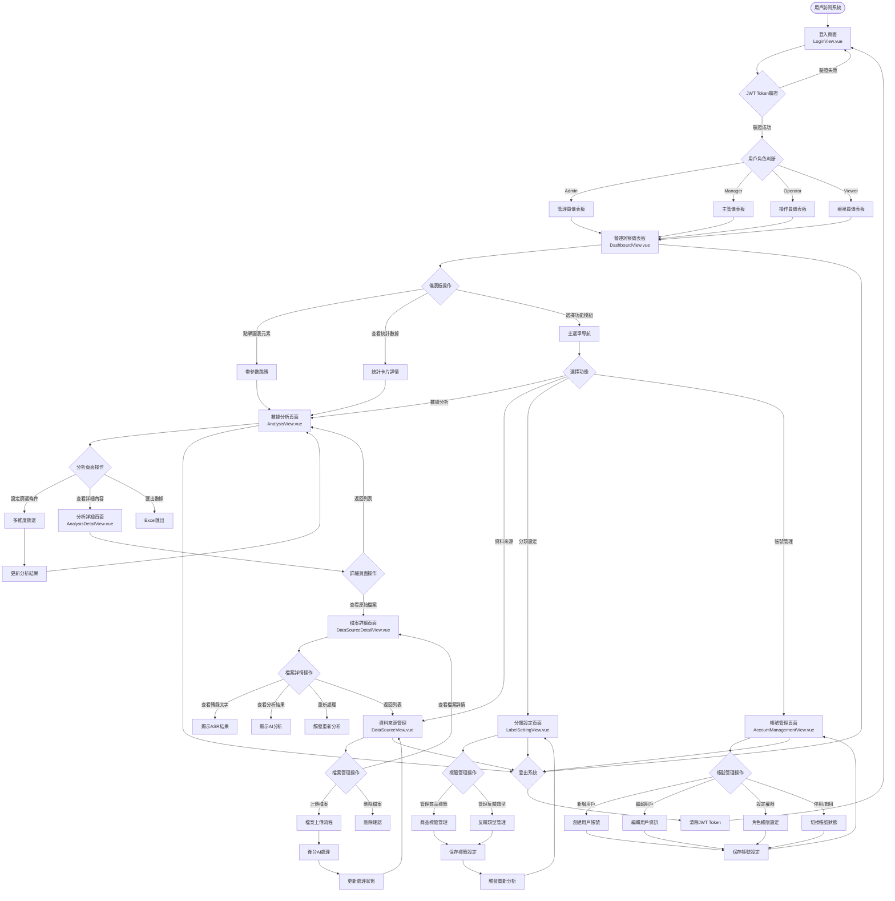
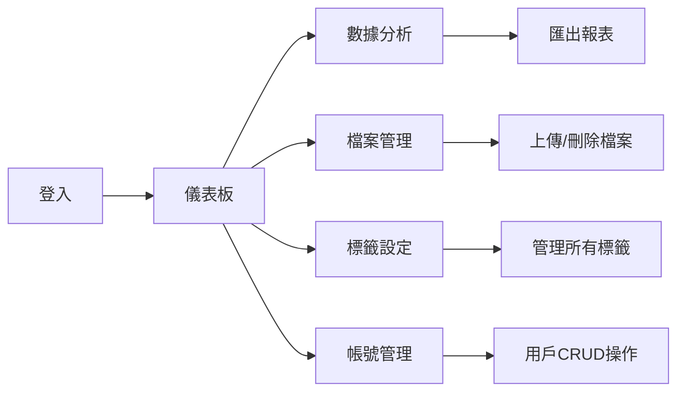
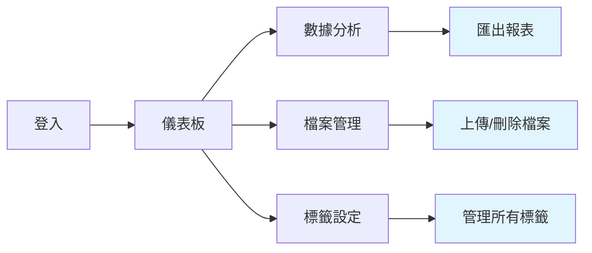
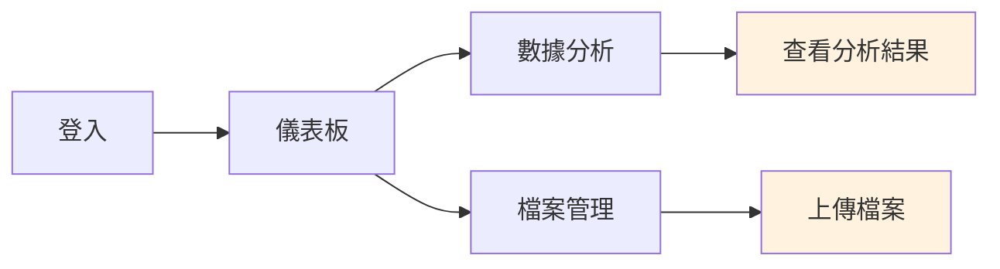
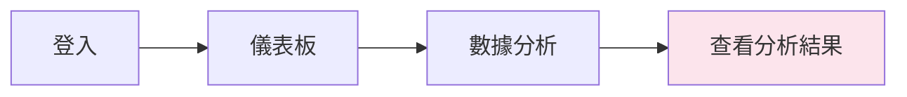
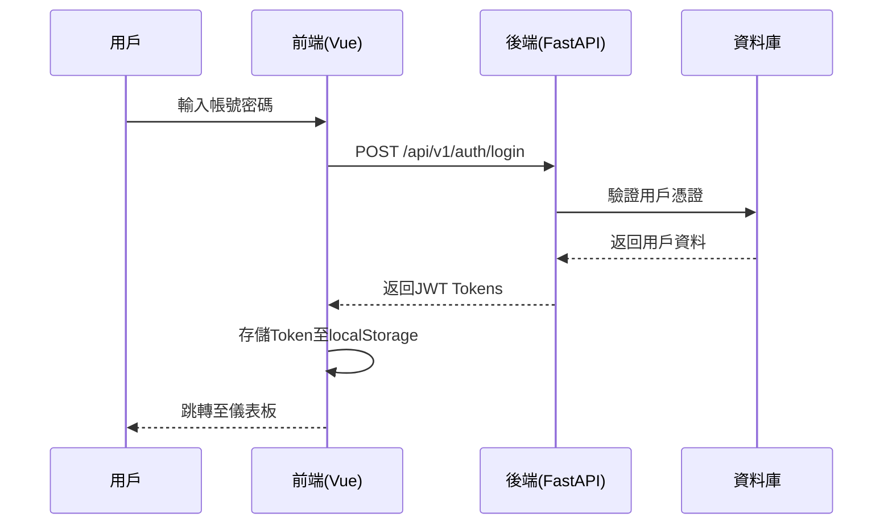
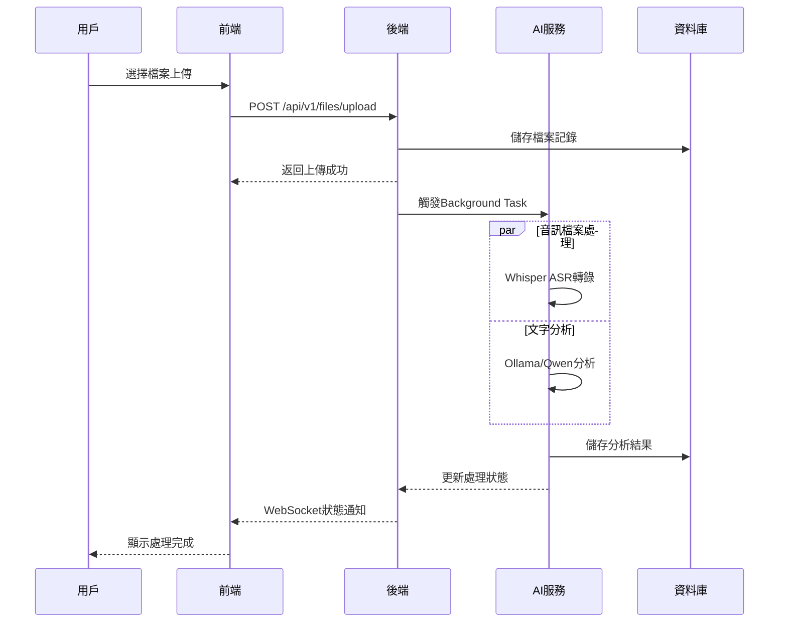
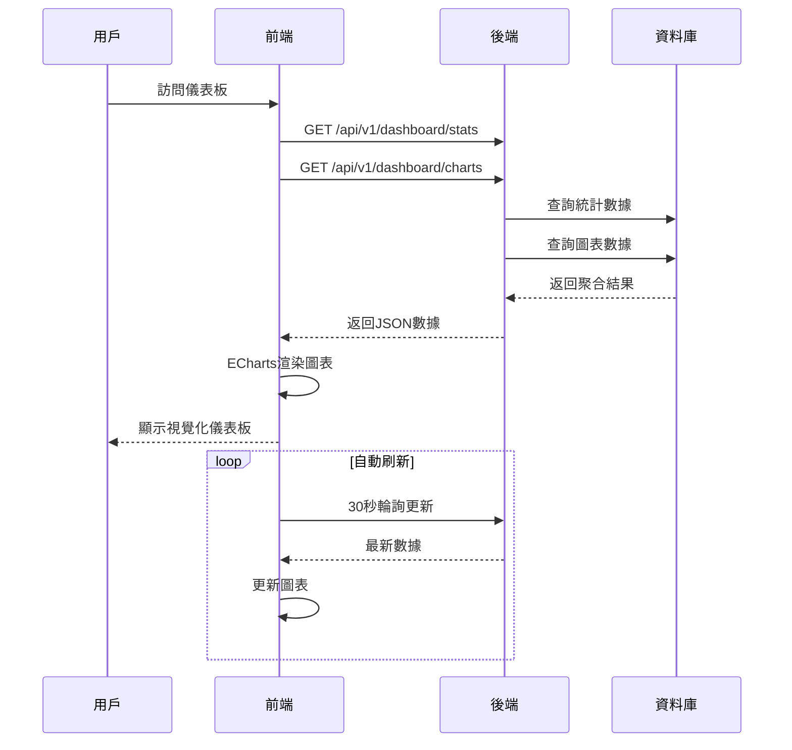

# 奇美食品客服語音分析系統 - 用戶流程圖

## 業務場景說明
本流程圖展示了奇美食品客服語音分析系統的核心業務流程，基於實際系統實現，涵蓋用戶從登入到完成主要業務操作的完整路徑。系統支援語音客服數據的上傳、AI分析、標籤管理、數據視覺化和權限管理等核心功能。

## 核心業務流程圖

## 角色權限流程差異

### Admin (系統管理員) 完整流程

### Manager (主管) 流程

### Operator (操作員) 流程

### Viewer (檢視員) 流程

## 關鍵技術流程

### 1. 用戶認證流程

### 2. 檔案上傳與AI處理流程

### 3. 儀表板數據流程

## 業務場景流程

### 場景1：日常客服檔案處理
1. **操作員登入** → 儀表板查看概況
2. **上傳錄音檔** → 批次拖放上傳 .wav/.mp3 檔案
3. **等待AI處理** → 系統自動 ASR + LLM 分析
4. **查看處理結果** → 檢查轉錄準確度與分析結果
5. **標記異常檔案** → 對品質問題檔案標記處理

### 場景2：主管數據分析決策
1. **主管登入** → 儀表板總覽趨勢
2. **深入分析** → 點擊圖表跳轉詳細分析
3. **多維度篩選** → 按商品/時間/情感篩選
4. **發現問題** → 識別負評集中的產品
5. **匯出報表** → 生成Excel報告給相關部門

### 場景3：系統標籤優化
1. **主管登入** → 進入標籤設定頁面
2. **分析現有標籤** → 檢視標籤命中率統計
3. **新增標籤** → 添加新產品或反饋類型
4. **設定關鍵字** → 配置標籤匹配關鍵詞
5. **觸發重分析** → 系統重新分析歷史數據

### 場景4：系統管理員維護
1. **管理員登入** → 查看系統整體狀況
2. **用戶管理** → 新增/編輯用戶帳號
3. **權限設定** → 配置角色權限
4. **系統監控** → 檢查AI服務狀態
5. **數據維護** → 清理過期數據

## 異常處理流程

### 登入失敗處理
- Token過期 → 自動嘗試刷新 → 失敗則跳轉登入頁
- 帳號被停用 → 顯示錯誤訊息 → 聯繫管理員
- 密碼錯誤 → 顯示錯誤提示 → 重新輸入

### 檔案處理失敗
- 格式不支援 → 前端驗證阻擋 → 提示支援格式
- 檔案過大 → 上傳前檢查 → 壓縮或分割建議
- AI處理失敗 → 顯示錯誤狀態 → 提供重試按鈕

### 權限不足處理
- 頁面訪問 → 路由守衛攔截 → 跳轉無權限頁面
- 功能操作 → 按鈕隱藏或禁用 → 提示權限不足
- API調用 → 後端返回403 → 前端顯示錯誤訊息

## 性能優化流程

### 數據載入優化
- 分頁載入：大量數據分批獲取
- 虛擬滾動：表格長列表優化
- 快取機制：頻繁查詢數據快取
- 預載入：預測用戶操作提前載入

### 圖表渲染優化
- 數據聚合：後端預先計算統計數據
- 增量更新：只更新變化的數據點
- 防抖處理：用戶操作防抖避免頻繁請求
- 響應式更新：視窗大小變化自動調整

此用戶流程圖完整展現了系統的實際操作流程，基於真實的代碼實現和業務邏輯，為用戶使用和系統維護提供清晰的指導。